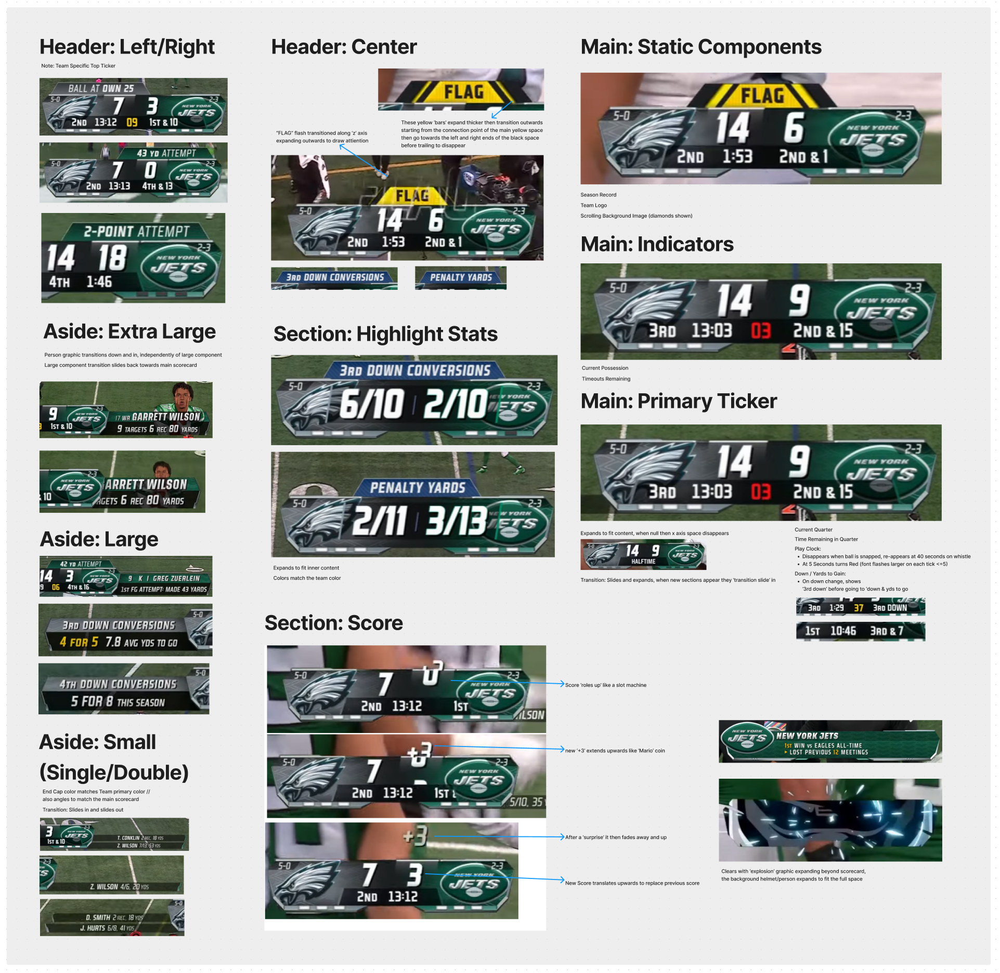

# Football Scoreboard App

## Goals:

1. Create an Application that can track the progress and scoring of a football game

## Scoreboard Prototype:

## Functionality Goals:

1. Info

## Visual Goals:

1. Score

## Proof of Concept:

- Will utilize 2 current NFL Rosters (Cowboys & Seahawks)

## Expected Coding Languages/Tools:

1. HTML
2. CSS
3. Vanilla JS
4. JSON Server

## Reference Material:

1. NFL Scoring Rulebook: https://operations.nfl.com/the-rules/nfl-video-rulebook/scoring-plays/
